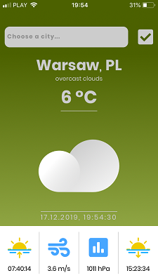
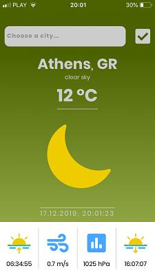
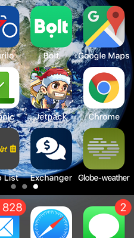

## GLOBE - weather app by [@Maciekbe89](http://github.com/Maciekbe89)!

### Hello

I presents to you my another mobile app in REACT JS :star2: It is classic WEATHER APP :sunny:

When in your city is `clear sky`, after sunset - sun evolves into moon :last_quarter_moon_with_face:

Of course, it works well in multiple mobile resolutions :iphone: and has also nice icon on home screen

### Thanks!
